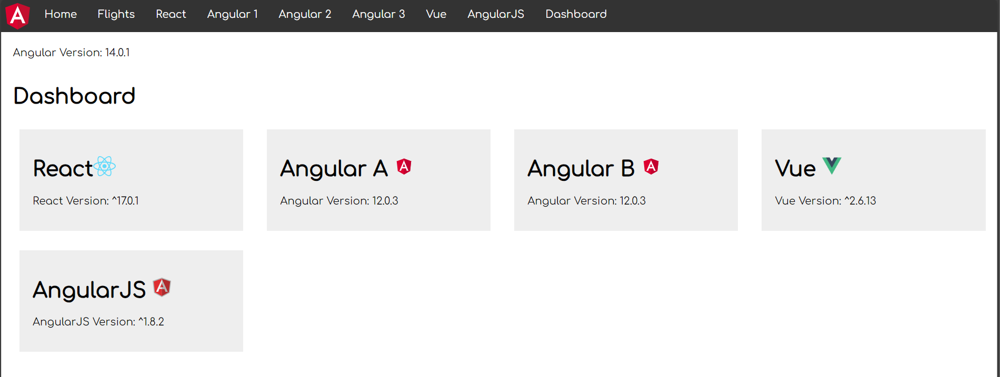

# Webpack Module Federation and multi-frameworks

- [TODO](#todo)
- [Webpack Module Federation and multi-frameworks](#webpack-module-federation-and-multi-frameworks-1)
  - [Example 1](#example-1)
  - [Example 2](#example-2)
  - [Other examples](#other-examples)

## TODO

## Webpack Module Federation and multi-frameworks

### Example 1

The [README](https://www.npmjs.com/package/@angular-architects/module-federation-tools) for the `@angular-architects/module-federation-tools` package shows an example of how to use Webpack Module Federation in a multi-framework environment. The example can be seem live at https://red-ocean-0fe4c4610.azurestaticapps.net/dashboard.

The setup includes:
- an Angular shell that loads MFEs that are in the same or different version of Angular, as well as MFEs using different frameworks such as React, Vue and AngularJS. The Angular shell contains the top navbar, as well as the content for the home and the dashboard tabs. The code for the shell is at [manfredsteyer/
multi-framework-version](https://github.com/manfredsteyer/multi-framework-version). This repo also contains an `mfe1` app which is the micro-frontend for the content of the flights tab.
- A React mfe app with code at [manfredsteyer/react-app](https://github.com/manfredsteyer/react-app).
- An Angular1 mfe app with code at [manfredsteyer/angular-app1](https://github.com/manfredsteyer/angular-app1).
- An Angular2 mfe app with code at [manfredsteyer/angular-app2](https://github.com/manfredsteyer/angular-app2).
- An Angular3 mfe app with code at [manfredsteyer/angular3-app](https://github.com/manfredsteyer/angular3-app).
- A Vue mfe app with code at [manfredsteyer/vue-js](https://github.com/manfredsteyer/vue-js).
- An AngularJS mfe app with code at [manfredsteyer/angularjs-app](https://github.com/manfredsteyer/angularjs-app).

There's also a [tutorial](https://github.com/angular-architects/module-federation-plugin/blob/main/libs/mf-tools/tutorial/index.md) available for the above setup.

### Example 2

Another example of a multi-framework setup can be found at [manfredsteyer/multi-framework-micro-frontend](https://github.com/manfredsteyer/multi-framework-micro-frontend). This example contains:
- a shell in Angular 13.
- a mfe1 app in Angular 13.
- a mfe2 app in Angular 12.
- a mfe3 app in Angular 12.
- a mfe4 app in React 17.

### Other examples

Other examples and guides about multi-framework setups can be found in:

- the [module-federation/module-federation-examples](https://github.com/module-federation/module-federation-examples) repo.
- the [Let's build together a microfrontends application combining multiple frameworks using Module Federation](https://www.youtube.com/watch?v=libbOCJH6pc) video from the `Devoxx Belgium 2023 Conference`.
- [Multi-Framework and -Version Micro Frontends with Module Federation: Your 4 Steps Guide](https://www.angulararchitects.io/en/blog/multi-framework-and-version-micro-frontends-with-module-federation-your-4-steps-guide/)
- [Multi-Framework and -Version Micro Frontends with Module Federation: The Good, the Bad, the Ugly](https://www.angulararchitects.io/en/blog/multi-framework-and-version-micro-frontends-with-module-federation-the-good-the-bad-the-ugly/)
- [Micro Frontends with Modern Angular – Part 2: Multi-Version and Multi-Framework Solutions with Angular Elements and Web Components](https://www.angulararchitects.io/en/blog/micro-frontends-with-modern-angular-part-2-multi-version-and-multi-framework-solutions-with-angular-elements-and-web-components/)
